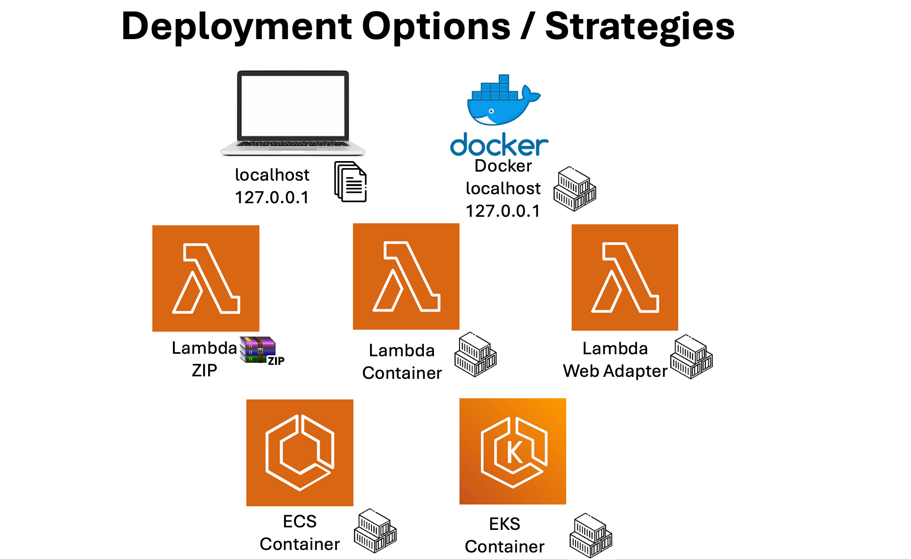
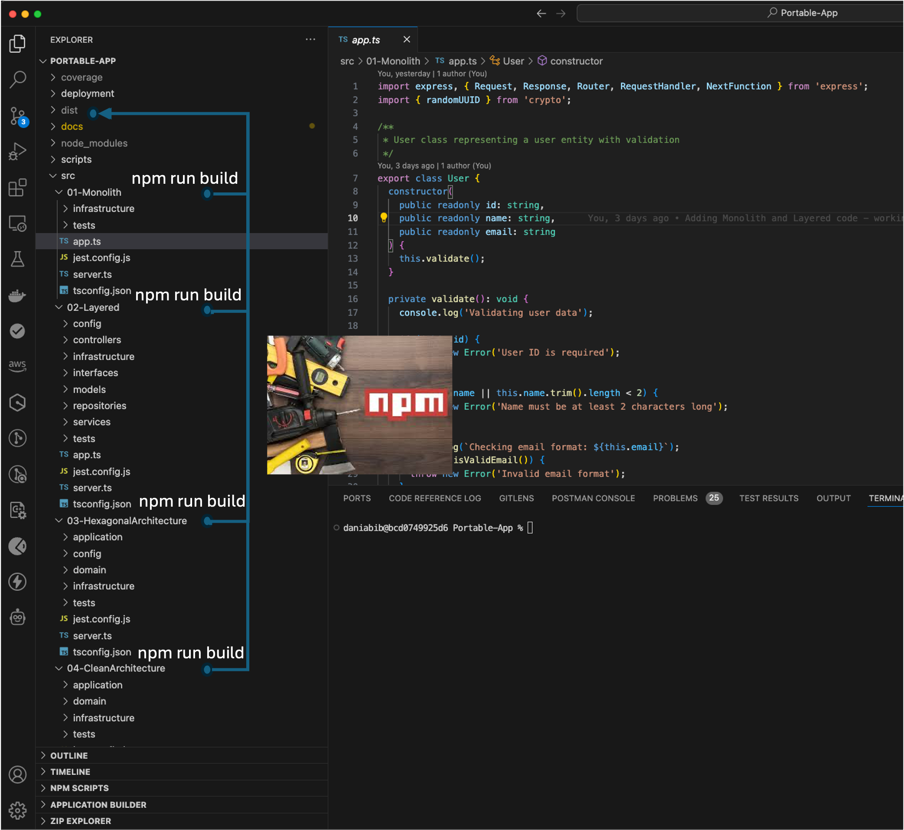

# AWS Deployment Models

This document explains the different deployment options available in this project and their characteristics.

    

> **Important Note**: There is no universally "best" deployment strategy. Each AWS service has its place and purpose. The choice of deployment service should be based on your specific needs, team expertise, and project requirements. Many successful applications started with simple Lambda functions and evolved to container-based solutions as their needs grew.

While Kubernetes (EKS) might seem like the ultimate solution, it's not always the best choice for every project. A well-implemented Lambda function can be more cost-effective and easier to maintain than a poorly implemented Kubernetes cluster. Consider your team's expertise, operational overhead, and deployment velocity when choosing a deployment strategy.

The success of any deployment heavily depends on:
- Your application's architecture and requirements
- Expected traffic patterns and scaling needs
- Team's operational capabilities and DevOps expertise
- Cost considerations and budget constraints
- Compliance and security requirements

    

# 1. Deployment Comparison

| Feature | Lambda ZIP | Lambda Container | Lambda Web Adapter | ECS | EKS |
|---------|------------|------------------|-------------------|-----|-----|
| Infrastructure Complexity | Low | Low-Medium | Medium | Medium-High | High |
| Operational Overhead | Minimal | Low | Low | Medium | High |
| Cold Start Time | Fast | Fast | Medium | Medium-to-High | Medium-to-High |
| Scaling Capabilities | Automatic, Instant | Automatic, Instant | Automatic, Instant | Configurable | Advanced (HPA/VPA) |
| Cost Model | Pay-per-use | Pay-per-use | Pay-per-use | Reserved/On-demand | Reserved/On-demand |
| Container Support | No | Yes | Yes | Yes | Yes |
| HTTP Capabilities | Basic | Basic | Advanced | Full | Full |
| Development Complexity | Low | Medium | Medium | Medium-High | High |

# 2. Architecture Compatibility

All deployment options presented in this document are compatible with every architectural pattern discussed in the [Application Architecture Documentation](../application-architecture/main-architecture.md). This means you can deploy applications built with:
- Monolithic Architecture
- Layered Architecture
- Hexagonal Architecture
- Clean Architecture

This flexibility allows you to choose the best combination of architecture and deployment strategy based on your specific needs. For example, you could deploy a Clean Architecture application using Lambda ZIP for simplicity, or use EKS for a Layered Architecture application that requires complex orchestration.

From a technical perspective, this flexibility is achieved through a standardized build process. Each architectural implementation (Monolithic, Layered, Hexagonal, and Clean) generates a `./dist` directory in the project root when you run `npm run build` in the respective architecture directory. This directory contains the transpiled TypeScript/JavaScript files ready for deployment. The standardized output ensures that regardless of the internal architecture, the deployment process remains consistent and predictable.

> **Note**: Each time you run the build command, the deployment code will change. While this approach **IS NOT** be ideal for production environments where you want deterministic builds, it serves perfectly for this project's learning purposes, allowing you to experiment with different architectural patterns and deployment options freely.

    

With well-implemented software architecture principles, the deployment service becomes truly agnostic, effectively avoiding vendor or service lock-in. This architectural independence means you can migrate between different AWS services or even to other cloud providers without significant code changes.

    

# 3. Deployment Implementations

> **Critical Learning Path**: To fully understand the deployment options and their trade-offs, it is essential to explore each implementation in sequence. We strongly recommend following these steps:

1. Start with [Lambda ZIP Deployment](./lambda-zip-deployment.md)
   - Understand the basics of serverless deployment
   - Experience the simplest deployment model
   - Learn about Lambda limitations and capabilities

2. Progress to [Lambda Container Deployment](./lambda-container-deployment.md)
   - See how containers work with Lambda
   - Understand the benefits of containerization
   - Learn about container image management

3. Advance to [Lambda Web Adapter Deployment](./lambda-web-adapter-deployment.md)
   - Experience enhanced HTTP capabilities
   - Learn about web framework compatibility
   - Understand advanced request/response handling

4. Move to [ECS Deployment](./ecs-deployment.md)
   - Learn about container orchestration
   - Understand managed container services
   - Experience production-grade deployments

5. Finally, explore [EKS Deployment](./eks-deployment.md)
   - Master Kubernetes-based deployment
   - Understand advanced orchestration
   - Learn about cloud-agnostic deployment

Each implementation contains working infrastructure code that you can deploy to AWS. By following this progression, you'll gain practical insights into how each deployment strategy handles the same application differently.

# 4. Infrastructure as Code

All deployment options are defined using Infrastructure as Code:
- Lambda: AWS SAM templates
- ECS: CloudFormation templates
- EKS: eksctl and Kubernetes manifests

This ensures:
- Reproducible deployments
- Version control for infrastructure
- Automated provisioning
- Consistent environments

# 5. Architecture Decisions

All significant architectural decisions in this project, including those related to deployment strategies and infrastructure choices, are documented in our [Architecture Decision Records (ADRs)](../../architecture-decision-records/README.md). These records provide valuable context about why certain technical choices were made, considering requirements, constraints, and trade-offs at the time of the decision.

Key deployment-related ADRs include:
- [Modern Deployment Approach](../../architecture-decision-records/0005-modern-deployment-approach.md)
- [Generic Dockerfile Strategy](../../architecture-decision-records/0006-generic-dockerfile.md)
- [AWS SAM and CloudFormation for IaC](../../architecture-decision-records/0014-aws-sam-cloudformation.md)

We encourage reviewing these ADRs to understand the reasoning behind our deployment architecture choices and how they support our goals of maintaining deployment flexibility while ensuring robust infrastructure management.

# 6. Docker Strategies

The project implements sophisticated Docker strategies to ensure efficient containerization across different deployment models. For detailed information about our Docker implementation, including multi-stage builds, optimizations, and best practices, refer to our [Docker documentation](../docker.md).

## 6.1 Key Aspects

### 6.1.1 Multi-stage Builds
- Separate build and production stages
- Optimized final image size
- Improved security through minimal attack surface

### 6.1.2 Base Image Selection
- Uses slim variants for minimal footprint
- Maintains essential packages only
- Regular security updates

### 6.1.3 Security Practices
- Removal of unnecessary files
- Non-root user execution
- Minimal attack surface maintenance

### 6.1.4 Health Monitoring
- Integrated application health checks
- Automatic recovery support
- Container orchestration readiness

### 6.1.5 CI/CD Integration
- Automated build and test processes
- Version-specific tagging support
- Environment-specific deployment paths
